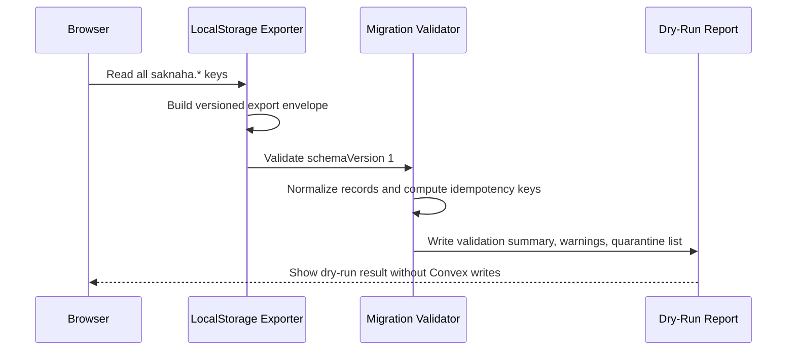
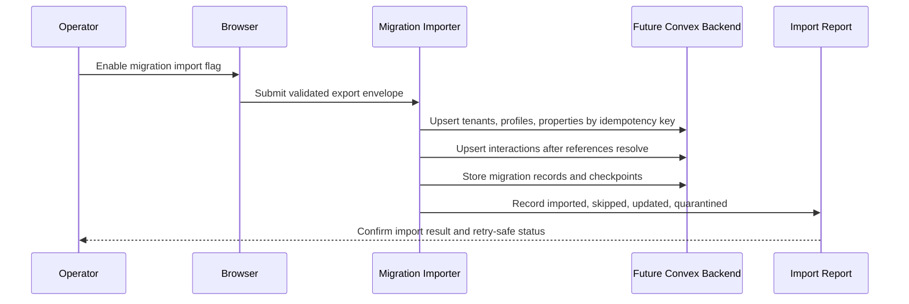
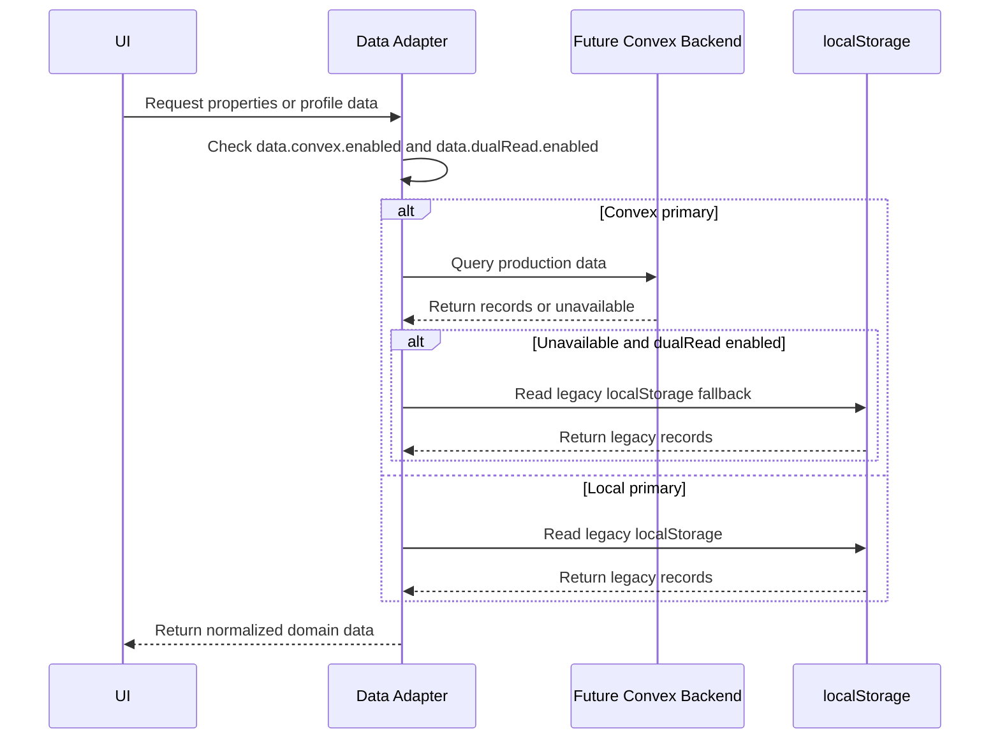
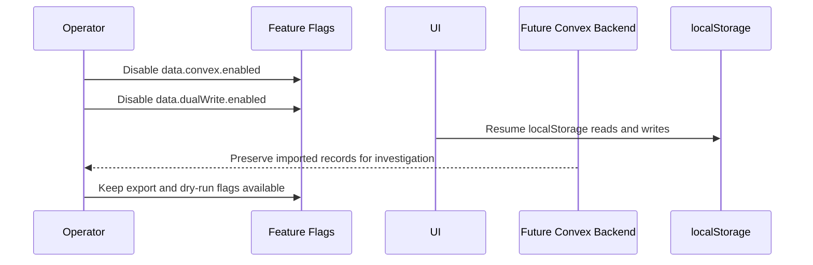

# Data Migration Strategy

## Purpose

This document defines the migration path from the current browser `localStorage` data model to future Convex tables without data loss. M3 is documentation and planning only: it does not add Convex code, schema files, migration scripts, or application behavior changes.

## Scope

In scope:

- Inventory every current `localStorage` key.
- Define future Convex table targets.
- Define validation, idempotency, compatibility, rollback, and schema versioning.
- Define sequence diagrams for dry run, import, compatibility, and rollback.

Out of scope:

- Convex schema implementation.
- Backend functions.
- UI behavior changes.
- Automatic import/export tooling.
- Auth implementation.

## Current Storage Inventory

The application uses these keys:

| Key                        | Current writer/reader | Current structure                                                                                                                                                                           | Future Convex table                                                            | Migration strategy                                                                                                                                                                                                                                            | Validation rules                                                                                                                                                                                                                                                    | Rollback strategy                                                                                                                                                              |
| -------------------------- | --------------------- | ------------------------------------------------------------------------------------------------------------------------------------------------------------------------------------------- | ------------------------------------------------------------------------------ | ------------------------------------------------------------------------------------------------------------------------------------------------------------------------------------------------------------------------------------------------------------- | ------------------------------------------------------------------------------------------------------------------------------------------------------------------------------------------------------------------------------------------------------------------- | ------------------------------------------------------------------------------------------------------------------------------------------------------------------------------ |
| `saknaha.owners`           | `userService.ts`      | `Owner[]`: `id`, `fullName`, `phone`, `ministryPropertyNumber`, `createdAt`                                                                                                                 | `ownerProfiles`, `tenants`, `memberships`                                      | Import each owner as an owner profile; create one tenant per owner unless a later business rule links owners into an organization; create an owner membership. Preserve legacy ID in migration metadata.                                                      | Required string fields: `id`, `fullName`, `phone`, `createdAt`; phone normalized to digits; license number retained but not trusted as verified.                                                                                                                    | Keep original localStorage untouched; disable Convex read flag and return to local owner login flow during compatibility period.                                               |
| `saknaha.currentOwner`     | `userService.ts`      | `Owner                                                                                                                                                                                      | null`: full owner object for current browser session                           | Auth/session derived, not a durable domain table                                                                                                                                                                                                              | Do not import as an authoritative session. Use only as a client-side hint to map a user to an owner profile during an authenticated migration.                                                                                                                      | Must match an owner in `saknaha.owners` by legacy `id` or normalized phone before any profile-linking action.                                                                  | Clear only the Convex session; leave localStorage current owner untouched until migration is confirmed. |
| `saknaha.users`            | `userService.ts`      | `User[]`: `id`, `name`, `phone`, `role`, `city`, `monthlyBudget`, `acceptsRoommate`, `createdAt`                                                                                            | `userProfiles`                                                                 | Import each user profile after authentication or as a staged legacy profile awaiting account claim. Preserve legacy ID in migration metadata.                                                                                                                 | Required string fields: `id`, `name`, `phone`, `role`, `city`, `createdAt`; `role` must be `student` or `employee`; `monthlyBudget` must be finite and non-negative.                                                                                                | Keep local user records; disable Convex profile reads and return to local user lookup if rollout is reverted.                                                                  |
| `saknaha.currentUser`      | `userService.ts`      | `User                                                                                                                                                                                       | null`: full user object for current browser session                            | Auth/session derived, not a durable domain table                                                                                                                                                                                                              | Do not import as a session. Use only as a claim hint for linking authenticated identity to a legacy user profile.                                                                                                                                                   | Must match a user in `saknaha.users` by legacy `id` or normalized phone.                                                                                                       | Clear Convex session only; do not remove local current user during compatibility.                       |
| `saknaha.properties`       | `propertyService.ts`  | `Property[]`: property records, including mock records, owner data, services, media URLs/data URLs, status, location fields, legacy `rooms` normalization support                           | `properties`, `propertyServices`, `propertyMedia`, optional `migrationRecords` | Import only user-created or owner-submitted records by default; seed mock records separately in Convex Foundation. Normalize legacy fields before import. Store media URLs/data URLs as migration references until M10 media pipeline imports approved media. | Required: `id`, `ownerId`, `title`, `city`, `neighborhood`, `address`, `price`, `status`, `createdAt`; status must be `published`, `draft`, or `paused`; price and counts must be finite and non-negative; services must have type, name, distance value, and unit. | Keep local properties as source of truth until Convex migration is verified. Disable `data.convex.enabled`; if dual-write was enabled, reconcile by legacy ID before rollback. |
| `saknaha.interests`        | `propertyService.ts`  | `Interest[]`: `id`, `userId`, `propertyId`, `mode`, `createdAt`                                                                                                                             | `interests`                                                                    | Import after users and properties so foreign references can be resolved. Store unresolved records in a migration quarantine list, not silently dropped.                                                                                                       | `mode` must be `whole-unit`, `roommate`, `visit`, or `general`; referenced user and property must exist or be quarantined; `createdAt` must parse as a date.                                                                                                        | Keep local interests; disable Convex interest reads/writes and re-enable local service adapter.                                                                                |
| `saknaha.favorites`        | `propertyService.ts`  | `FavoriteProperty[]`: `id`, `userId`, `propertyId`, `city`, `createdAt`                                                                                                                     | `favorites`                                                                    | Import after users and properties. Use `(userId, propertyId)` as the logical idempotency key to avoid duplicate favorites.                                                                                                                                    | Referenced user and property must exist; city must match property city when resolvable; duplicate user-property pairs collapse to the earliest `createdAt`.                                                                                                         | Keep local favorites; disable Convex favorites read/write and rebuild UI state from localStorage.                                                                              |
| `saknaha.roommates`        | `propertyService.ts`  | `RoommatePreference[]`: `id`, `userId`, `propertyId`, `roomsWanted`, `acceptsSharedContract`, `createdAt`                                                                                   | `roommatePreferences`                                                          | Import after users and properties. Use `(userId, propertyId)` as the logical idempotency key unless multiple preferences are explicitly supported later.                                                                                                      | `roomsWanted` must be positive; `acceptsSharedContract` must be boolean; referenced user and property must exist or be quarantined.                                                                                                                                 | Keep local preferences; disable Convex roommate preference reads/writes.                                                                                                       |
| `saknaha.roommateRequests` | `propertyService.ts`  | `RoommateRequest[]`: `id`, `propertyId`, `userId`, `userType`, `age`, `organization`, `major`, `moveInDate`, `bio`, `availableRooms`, `createdAt`; app also adds demo requests at read time | `roommateRequests`                                                             | Import user-created records. Seed demo requests separately or exclude `demo-roommate-*` from user migration. Preserve legacy ID in migration metadata.                                                                                                        | `userType` must be `student` or `employee`; `age` must be reasonable and positive; `availableRooms` must be positive; references must resolve or be quarantined.                                                                                                    | Keep local roommate requests; disable Convex reads and restore local generated demo behavior.                                                                                  |
| `saknaha.negotiations`     | `propertyService.ts`  | `NegotiationSignal[]`: `id`, `userId`, `propertyId`, `suggestedPrice`, `reason`, `createdAt`                                                                                                | `negotiationSignals`                                                           | Import after users and properties. Use legacy `id` as the idempotency key. Quarantine if user or property cannot be resolved.                                                                                                                                 | `suggestedPrice` must be finite and positive; `reason` must be non-empty after trimming; references must resolve.                                                                                                                                                   | Keep local negotiations; disable Convex negotiation reads/writes.                                                                                                              |

## Export Envelope

Future migration tooling should export a single versioned JSON envelope before any import writes occur:

```json
{
  "schemaVersion": 1,
  "exportedAt": "2026-07-08T00:00:00.000Z",
  "source": "saknaha-web-localStorage",
  "appBuild": "unknown",
  "keys": {
    "saknaha.owners": [],
    "saknaha.currentOwner": null,
    "saknaha.users": [],
    "saknaha.currentUser": null,
    "saknaha.properties": [],
    "saknaha.interests": [],
    "saknaha.favorites": [],
    "saknaha.roommates": [],
    "saknaha.roommateRequests": [],
    "saknaha.negotiations": []
  },
  "checksums": {
    "saknaha.owners": "sha256-of-canonical-json"
  }
}
```

Rules:

- Missing keys are represented by their safe fallback value.
- Invalid JSON for a key is recorded as a validation error and the raw value is preserved in a quarantine export if possible.
- Export does not delete or mutate localStorage.
- Export must include a deterministic checksum per key for support and retry safety.

## Schema Versioning

Use an explicit migration schema version independent from Convex table versions.

Initial version:

- `schemaVersion: 1`
- Covers the current ten localStorage keys.
- Preserves legacy IDs and timestamps.
- Supports legacy property normalization for `rooms`, missing `videos`, missing `googleMapsUrl`, and legacy service `distance`.

Future versioning rules:

- Every migration changeset gets a monotonic integer version.
- Each version must define input shape, output shape, validation, idempotency keys, rollback notes, and compatibility flags.
- Import tooling must reject unknown future versions unless an explicit compatibility adapter exists.
- Version adapters must be pure transformations so dry runs and imports produce the same normalized records.
- Migration records in Convex should store `schemaVersion`, `sourceKey`, `legacyId`, `targetTable`, `targetId`, checksum, status, and timestamps.

## Idempotency Design

All migrations must safely run multiple times.

Required idempotency keys:

- Owners: `sourceKey + legacyOwnerId`, fallback `normalizedPhone`.
- Users: `sourceKey + legacyUserId`, fallback `normalizedPhone`.
- Properties: `sourceKey + legacyPropertyId`.
- Interests: `sourceKey + legacyInterestId`.
- Favorites: `userLegacyId + propertyLegacyId`.
- Roommate preferences: `userLegacyId + propertyLegacyId`.
- Roommate requests: `sourceKey + legacyRoommateRequestId`.
- Negotiation signals: `sourceKey + legacyNegotiationId`.
- Media references: `propertyLegacyId + mediaIndex + checksum`.

Idempotent behavior:

- Existing imported records are updated only when the incoming checksum differs.
- Duplicate logical records are collapsed according to deterministic rules.
- Failed or quarantined records remain retryable.
- Import progress is checkpointed per key and per record.
- Re-running a migration must never create duplicate tenant, user, property, favorite, or notification records.

## Compatibility Period

Convex and localStorage must coexist during a controlled compatibility period.

Required flags:

- `data.localStorageExport.enabled`: allows export/dry-run tooling.
- `data.convex.enabled`: switches reads to Convex.
- `data.dualRead.enabled`: allows fallback to localStorage when Convex data is unavailable.
- `data.dualWrite.enabled`: writes to both stores during a limited transition.
- `data.migrationDryRun.enabled`: validates without writing to Convex.
- `data.migrationImport.enabled`: permits import writes after approval.

Compatibility stages:

1. Local-only: current behavior.
2. Export-only: users/operators can export localStorage data.
3. Dry-run: validate export against migration rules and produce a report.
4. Import-disabled review: no writes, only review validation results.
5. Import enabled: write idempotently to Convex.
6. Dual-read: compare Convex and localStorage results.
7. Convex primary with local fallback.
8. Convex-only after support window closes.

LocalStorage should not be deleted automatically. Cleanup, if ever needed, must be a separate approved task after backup and support requirements are met.

## Conflict Handling

Conflict rules:

- Prefer authenticated Convex identity over legacy `currentOwner` or `currentUser`.
- Prefer legacy IDs for idempotency, not authorization.
- When duplicate owners/users share a phone number, import one profile and quarantine conflicting profile details for manual review.
- When a property references a missing owner, import as quarantined or attach to a migration holding tenant, never publish automatically.
- When interactions reference missing users or properties, quarantine them and continue importing other records.
- When localStorage and Convex both changed during dual-write, compare `updatedAt` when available; otherwise preserve both versions and require manual review.

## Sequence Diagrams

### Dry Run



### Approved Import



### Compatibility Reads



### Rollback



## Validation Report Requirements

Dry-run and import reports should include:

- total keys found,
- missing keys,
- invalid JSON keys,
- records read per key,
- records accepted,
- records normalized,
- records skipped as mock/demo seed data,
- records quarantined,
- duplicate records collapsed,
- unresolved references,
- checksum summary,
- migration schema version,
- timestamp,
- operator or authenticated user when available.

## Rollback Requirements

Rollback must be possible at every stage before Convex-only cleanup:

- Disable Convex reads.
- Disable dual writes.
- Keep localStorage intact.
- Keep Convex imported records for audit and diffing.
- Do not delete migration checkpoints.
- Re-run dry run after any fix.
- Resume import idempotently after approval.

## M4 Handoff Requirements

Before Convex Foundation implementation starts, M4 must use this document as the contract for:

- schema and table naming,
- migration record tracking,
- idempotency keys,
- dry-run output shape,
- compatibility feature flags,
- quarantine handling,
- rollback controls.

No Convex schema or backend migration code should be implemented until M3 is approved.
