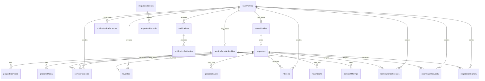

# Database Design Review

## Purpose

This document is the approval gate before any Convex schema, backend functions, generated code, or data adapters are implemented. It proposes a single-platform production database model for Saknaha and aligns it with the M3 migration strategy.

Saknaha is not modeled as a multi-tenant SaaS product. It is one platform serving all regions, with platform-level role-based authorization for `admin`, `support`, `moderator`, `owner`, `user`, and `service_provider`.

## Architecture Decision

The tenant architecture should not be retained for M4.

Reasons:

- Saknaha has one global platform, one admin dashboard, and one shared marketplace across Saudi Arabia.
- Property ownership is a direct relationship between a platform user and an owner profile; adding tenant ownership would duplicate that boundary without improving authorization.
- Housing seekers, roommate seekers, and future service providers do not belong to separate customer organizations.
- Region, city, owner, property, and service-provider filters provide the operational segmentation the product needs without organization isolation.
- Tenant tables would add join complexity, migration complexity, support burden, and IDOR risk surface without a clear current product requirement.

The approved model removes `tenants`, `memberships`, `tenantSettings`, and any `tenantId` field used only for tenant isolation. If future enterprise or franchise operations require organization boundaries, that should be introduced deliberately as a new product capability rather than preloaded into the first production schema.

This is design only. Do not create `convex/schema.ts` or any Convex functions until this document is approved.

## Convex Design Notes

- Convex schemas define tables and document validators; Convex automatically adds `_id` and `_creationTime`.
- Convex document IDs are globally unique strings and become table-specific `Id<"table">` types in generated TypeScript.
- Indexes are table-level definitions with ordered fields and should match query access patterns.
- Search indexes are separate from normal indexes and support a `searchField` plus equality filter fields.
- Convex Storage IDs such as `Id<"_storage">` are safe to store in tables, but generated file URLs are bearer URLs and should only be shared after app-level authorization checks.

References:

- https://docs.convex.dev/database/schemas
- https://docs.convex.dev/database/document-ids
- https://docs.convex.dev/database/reading-data/indexes
- https://docs.convex.dev/search/text-search
- https://docs.convex.dev/file-storage/overview

## ER Diagram

## Relationship Cardinality

- A user profile can optionally have one owner profile.
- A user profile can optionally have one service provider profile.
- An owner profile links directly to one user profile and can own many properties.
- A service provider profile links directly to one user profile and can publish many service offerings.
- A property belongs to exactly one owner profile.
- A service request belongs to one requester and may reference one service provider profile, one service offering, and one property.
- A property can have many services, media records, favorites, interests, roommate preferences, roommate requests, and negotiation signals.
- Favorites and roommate preferences should be unique per `(userId, propertyId)`.
- Notifications belong to one user and may have many delivery attempts.
- Migration batches contain many migration records.
- Platform-level operational tables are global and may optionally reference a user, owner profile, service provider profile, property, service offering, or job.

## Table List

Core identity and authorization:

- `userProfiles`
- `ownerProfiles`
- `serviceProviderProfiles`
- `roleAssignments`

Listings and marketplace activity:

- `properties`
- `propertyServices`
- `propertyMedia`
- `serviceOfferings`
- `serviceRequests`
- `favorites`
- `interests`
- `roommatePreferences`
- `roommateRequests`
- `negotiationSignals`

Maps and provider cache:

- `geocodeCache`
- `placeCache`
- `routeCache`

Notifications and background work:

- `notificationPreferences`
- `notifications`
- `notificationDeliveries`
- `jobs`

Security, provider usage, and operations:

- `otpChallenges`
- `smsMessages`
- `smsProviderHealth`
- `rateLimits`
- `providerUsageEvents`
- `costSnapshots`
- `auditEvents`
- `featureFlagOverrides`

Migration:

- `migrationBatches`
- `migrationRecords`

## Notation

- `Id<table>` means Convex document ID reference.
- `StorageId` means `Id<"_storage">`.
- `required` fields must be present in every document.
- `optional` fields use Convex optional validators or nullable values by design.
- `_id` and `_creationTime` are implicit Convex fields and are not repeated in every table.
- Times are stored as epoch milliseconds in `number` fields unless explicitly noted.

## Table Field Design

### `userProfiles`

| Field             | Type                                                                        | Required | Notes                                                                   |
| ----------------- | --------------------------------------------------------------------------- | -------- | ----------------------------------------------------------------------- |
| `authSubject`     | string                                                                      | optional | Convex Auth subject after M5; optional for migrated unclaimed profiles. |
| `legacyUserId`    | string                                                                      | optional | From localStorage migration.                                            |
| `name`            | string                                                                      | yes      | Display name.                                                           |
| `email`           | string                                                                      | optional | Normalized lowercase.                                                   |
| `phone`           | string                                                                      | optional | Normalized E.164 or digit-only migration fallback.                      |
| `primaryRole`     | union: `admin`, `support`, `moderator`, `owner`, `user`, `service_provider` | yes      | Platform role used for default authorization.                           |
| `userType`        | union: `student`, `employee`                                                | optional | Current renter/searcher profile type.                                   |
| `city`            | string                                                                      | optional | User preference.                                                        |
| `monthlyBudget`   | number                                                                      | optional | Non-negative.                                                           |
| `acceptsRoommate` | boolean                                                                     | optional | User preference.                                                        |
| `status`          | union: `active`, `pending_claim`, `suspended`, `deleted`                    | yes      | Migration and moderation state.                                         |
| `createdAt`       | number                                                                      | yes      | Epoch ms.                                                               |
| `updatedAt`       | number                                                                      | yes      | Epoch ms.                                                               |
| `deletedAt`       | number                                                                      | optional | Soft-delete timestamp.                                                  |

Indexes:

- `by_auth_subject`: `authSubject`; session lookup.
- `by_legacy_user`: `legacyUserId`; idempotent migration.
- `by_phone`: `phone`; account linking and support.
- `by_email`: `email`; account linking.
- `by_primary_role`: `primaryRole`; admin/support user management and provider moderation queues.
- `by_status`: `status`; admin moderation.

Delete/update behavior:

- Soft-delete users; redact PII after retention window.
- Deleting a user does not delete audit events, property records, or provider usage records.
- If an owner or service provider user is deleted, linked properties or service offerings are paused until ownership is resolved.

### `ownerProfiles`

| Field                    | Type                                                   | Required | Notes                                            |
| ------------------------ | ------------------------------------------------------ | -------- | ------------------------------------------------ |
| `userId`                 | Id<userProfiles>                                       | yes      | Direct link to authenticated platform user.      |
| `legacyOwnerId`          | string                                                 | optional | From localStorage migration.                     |
| `fullName`               | string                                                 | yes      | Owner display name.                              |
| `phone`                  | string                                                 | yes      | Normalized.                                      |
| `ministryPropertyNumber` | string                                                 | optional | Current frontend field; not verified by default. |
| `verificationStatus`     | union: `unverified`, `pending`, `verified`, `rejected` | yes      | Owner verification.                              |
| `status`                 | union: `active`, `suspended`, `deleted`                | yes      | Owner account state.                             |
| `createdAt`              | number                                                 | yes      | Epoch ms.                                        |
| `updatedAt`              | number                                                 | yes      | Epoch ms.                                        |
| `deletedAt`              | number                                                 | optional | Soft-delete timestamp.                           |

Indexes:

- `by_user`: `userId`; profile lookup from auth user.
- `by_legacy_owner`: `legacyOwnerId`; idempotent migration.
- `by_phone`: `phone`; account linking and support.
- `by_verification_status`: `verificationStatus`; operations queue.
- `by_status`: `status`; owner moderation.

Delete/update behavior:

- Soft-delete owner profiles.
- Owner suspension pauses or hides owner-only write actions.
- Verification changes emit audit events.

### `serviceProviderProfiles`

| Field                | Type                                                   | Required | Notes                                                             |
| -------------------- | ------------------------------------------------------ | -------- | ----------------------------------------------------------------- |
| `userId`             | Id<userProfiles>                                       | yes      | Direct link to authenticated platform user.                       |
| `businessName`       | string                                                 | yes      | Public or operational service-provider display name.              |
| `contactName`        | string                                                 | optional | Private operations contact.                                       |
| `phone`              | string                                                 | optional | Normalized service contact number.                                |
| `email`              | string                                                 | optional | Normalized service contact email.                                 |
| `serviceCategories`  | array<string>                                          | yes      | Examples: cleaning, maintenance, moving, internet, furnishing.    |
| `primaryCity`        | string                                                 | optional | Main operating city for admin discovery.                          |
| `citiesServed`       | array<string>                                          | yes      | Saudi cities or regions covered; use offerings for query filters. |
| `verificationStatus` | union: `unverified`, `pending`, `verified`, `rejected` | yes      | Service-provider verification.                                    |
| `status`             | union: `active`, `paused`, `suspended`, `deleted`      | yes      | Account and marketplace visibility state.                         |
| `createdAt`          | number                                                 | yes      | Epoch ms.                                                         |
| `updatedAt`          | number                                                 | yes      | Epoch ms.                                                         |
| `deletedAt`          | number                                                 | optional | Soft-delete timestamp.                                            |

Indexes:

- `by_user`: `userId`; profile lookup from auth user.
- `by_status`: `status`; provider administration and moderation.
- `by_verification_status`: `verificationStatus`; verification queue.
- `by_primary_city_status`: `primaryCity`, `status`; admin/provider discovery by main city.

Delete/update behavior:

- Soft-delete service provider profiles.
- Suspension pauses provider write actions and hides public offerings.
- Verification changes emit audit events.

### `roleAssignments`

| Field                      | Type                                                                                         | Required | Notes                                             |
| -------------------------- | -------------------------------------------------------------------------------------------- | -------- | ------------------------------------------------- |
| `userId`                   | Id<userProfiles>                                                                             | yes      | User receiving role.                              |
| `role`                     | union: `admin`, `support`, `moderator`, `owner`, `user`, `service_provider`                  | yes      | Platform role.                                    |
| `scope`                    | union: `global`, `owner_profile`, `property`, `service_provider_profile`, `service_offering` | yes      | Future-safe scope without organization isolation. |
| `ownerProfileId`           | Id<ownerProfiles>                                                                            | optional | Scope for owner/support delegation.               |
| `propertyId`               | Id<properties>                                                                               | optional | Optional property-scoped role.                    |
| `serviceProviderProfileId` | Id<serviceProviderProfiles>                                                                  | optional | Optional service-provider-scoped role.            |
| `serviceOfferingId`        | Id<serviceOfferings>                                                                         | optional | Optional service-offering-scoped role.            |
| `status`                   | union: `active`, `disabled`                                                                  | yes      | Role state.                                       |
| `grantedByUserId`          | Id<userProfiles>                                                                             | optional | Granting admin/support/moderator user.            |
| `createdAt`                | number                                                                                       | yes      | Epoch ms.                                         |
| `updatedAt`                | number                                                                                       | yes      | Epoch ms.                                         |

Indexes:

- `by_user`: `userId`; load user roles.
- `by_user_role`: `userId`, `role`; authorization checks.
- `by_owner_profile`: `ownerProfileId`; owner-scoped delegation.
- `by_property`: `propertyId`; property-scoped delegation.
- `by_service_provider_profile`: `serviceProviderProfileId`; provider-scoped delegation.
- `by_service_offering`: `serviceOfferingId`; offering-scoped delegation.
- `by_status`: `status`; role administration.

Delete/update behavior:

- Disable role assignments instead of deleting.
- Role changes emit audit events.

### `properties`

| Field                   | Type                                                          | Required | Notes                                                                      |
| ----------------------- | ------------------------------------------------------------- | -------- | -------------------------------------------------------------------------- |
| `ownerProfileId`        | Id<ownerProfiles>                                             | yes      | Direct owner relationship.                                                 |
| `legacyPropertyId`      | string                                                        | optional | Migration idempotency.                                                     |
| `title`                 | string                                                        | yes      | Listing title.                                                             |
| `propertyLicenseNumber` | string                                                        | yes      | Required by current UI.                                                    |
| `city`                  | string                                                        | yes      | Filter/search field.                                                       |
| `neighborhood`          | string                                                        | yes      | Filter/search field.                                                       |
| `address`               | string                                                        | yes      | Restricted detail field; do not expose in list cards unless policy allows. |
| `universityNearby`      | string                                                        | yes      | Current UI field.                                                          |
| `googleMapsUrl`         | string                                                        | optional | External URL; validate before display.                                     |
| `lat`                   | number                                                        | optional | WGS84 latitude.                                                            |
| `lng`                   | number                                                        | optional | WGS84 longitude.                                                           |
| `geohash`               | string                                                        | optional | Prefix-based location filtering.                                           |
| `locationQuality`       | union: `manual`, `geocoded`, `verified`, `approximate`        | yes      | Trust level.                                                               |
| `classification`        | string                                                        | yes      | Current Arabic enum value.                                                 |
| `propertyType`          | string                                                        | yes      | Current Arabic enum value.                                                 |
| `minRooms`              | number                                                        | yes      | Positive integer.                                                          |
| `maxRooms`              | number                                                        | yes      | Positive integer >= minRooms.                                              |
| `floorsCount`           | number                                                        | yes      | Positive integer.                                                          |
| `hasElevator`           | boolean                                                       | yes      | Amenity.                                                                   |
| `hasCleaningWorker`     | boolean                                                       | yes      | Amenity.                                                                   |
| `hasTransportService`   | boolean                                                       | yes      | Amenity.                                                                   |
| `universityBusPasses`   | boolean                                                       | yes      | Amenity.                                                                   |
| `bathrooms`             | number                                                        | yes      | Non-negative integer.                                                      |
| `furnished`             | boolean                                                       | yes      | Amenity.                                                                   |
| `maxResidents`          | number                                                        | yes      | Positive integer.                                                          |
| `roommateAllowed`       | boolean                                                       | yes      | Roommate eligibility.                                                      |
| `requiresLeaseContract` | boolean                                                       | yes      | Defaults true.                                                             |
| `price`                 | number                                                        | yes      | Non-negative SAR amount.                                                   |
| `paymentType`           | string                                                        | yes      | Current Arabic enum value.                                                 |
| `negotiable`            | boolean                                                       | yes      | Pricing flag.                                                              |
| `allowWhatsappContact`  | boolean                                                       | yes      | Contact visibility flag.                                                   |
| `deposit`               | number                                                        | optional | Non-negative.                                                              |
| `priceNotes`            | string                                                        | optional | Owner text.                                                                |
| `status`                | union: `draft`, `published`, `paused`, `archived`, `rejected` | yes      | Listing state.                                                             |
| `moderationStatus`      | union: `pending`, `approved`, `rejected`, `needs_review`      | yes      | Public listing gate.                                                       |
| `searchText`            | string                                                        | yes      | Denormalized title/city/neighborhood/university text.                      |
| `distanceText`          | string                                                        | optional | Legacy display text.                                                       |
| `timeText`              | string                                                        | optional | Legacy display text.                                                       |
| `publishedAt`           | number                                                        | optional | Public ordering.                                                           |
| `createdAt`             | number                                                        | yes      | Epoch ms.                                                                  |
| `updatedAt`             | number                                                        | yes      | Epoch ms.                                                                  |
| `deletedAt`             | number                                                        | optional | Soft-delete timestamp.                                                     |

Indexes:

- `by_owner_status`: `ownerProfileId`, `status`; owner property dashboard.
- `by_status_city`: `status`, `city`; public city results.
- `by_status_city_price`: `status`, `city`, `price`; public price filtering.
- `by_status_geohash`: `status`, `geohash`; map/nearby prefix queries.
- `by_license`: `propertyLicenseNumber`; duplicate detection.
- `by_legacy_property`: `legacyPropertyId`; migration idempotency.
- `by_moderation_status`: `moderationStatus`; operations queue.
- `by_published_at`: `status`, `publishedAt`; newest public listings.
- `search_public_text`: search index on `searchText`, filter fields `status`, `city`, `classification`; public keyword search.

Delete/update behavior:

- Soft-delete or archive properties, never hard-delete during normal operations.
- Publishing requires owner/admin authorization, verification policy, media policy, and moderation status.
- Pausing preserves public URL but removes from public listing searches.

### `propertyServices`

| Field             | Type                                                                      | Required | Notes                            |
| ----------------- | ------------------------------------------------------------------------- | -------- | -------------------------------- |
| `propertyId`      | Id<properties>                                                            | yes      | Parent property.                 |
| `legacyServiceId` | string                                                                    | optional | Migration reference.             |
| `type`            | string                                                                    | yes      | Current service type enum value. |
| `name`            | string                                                                    | yes      | Service label.                   |
| `distanceValue`   | number                                                                    | yes      | Positive.                        |
| `distanceUnit`    | union: `meter`, `kilometer`, `walking_minutes`, `driving_minutes`, `hour` | yes      | Current enum.                    |
| `sortOrder`       | number                                                                    | yes      | Display order.                   |
| `createdAt`       | number                                                                    | yes      | Epoch ms.                        |
| `updatedAt`       | number                                                                    | yes      | Epoch ms.                        |

Indexes:

- `by_property`: `propertyId`; listing detail.

Delete/update behavior:

- Delete services when property is hard-deleted after retention; otherwise update in place.

### `propertyMedia`

| Field                | Type                                                                                                | Required | Notes                                             |
| -------------------- | --------------------------------------------------------------------------------------------------- | -------- | ------------------------------------------------- |
| `propertyId`         | Id<properties>                                                                                      | yes      | Parent property.                                  |
| `storageId`          | StorageId                                                                                           | optional | Convex Storage file ID once uploaded.             |
| `legacyUrl`          | string                                                                                              | optional | Existing URL/data URL reference during migration. |
| `kind`               | union: `image`, `video`                                                                             | yes      | Media type.                                       |
| `mimeType`           | string                                                                                              | optional | Validated MIME type.                              |
| `byteSize`           | number                                                                                              | optional | Size from metadata.                               |
| `checksum`           | string                                                                                              | optional | Content hash.                                     |
| `width`              | number                                                                                              | optional | Image/video metadata.                             |
| `height`             | number                                                                                              | optional | Image/video metadata.                             |
| `durationSeconds`    | number                                                                                              | optional | Video metadata.                                   |
| `thumbnailStorageId` | StorageId                                                                                           | optional | Generated thumbnail.                              |
| `status`             | union: `pending_upload`, `uploaded`, `processing`, `approved`, `rejected`, `quarantined`, `deleted` | yes      | Publication gate.                                 |
| `scanStatus`         | union: `not_required`, `pending`, `clean`, `failed`, `infected`                                     | yes      | Safety pipeline state.                            |
| `sortOrder`          | number                                                                                              | yes      | Display order.                                    |
| `createdAt`          | number                                                                                              | yes      | Epoch ms.                                         |
| `updatedAt`          | number                                                                                              | yes      | Epoch ms.                                         |
| `deletedAt`          | number                                                                                              | optional | Soft-delete timestamp.                            |

Indexes:

- `by_property`: `propertyId`; listing media.
- `by_status`: `status`; media moderation queue.
- `by_storage`: `storageId`; cleanup and metadata lookup.
- `by_checksum`: `checksum`; duplicate/orphan detection.

Delete/update behavior:

- Soft-delete media metadata first.
- Delete Convex Storage object only after rollback window and audit retention.
- Public URLs are generated only after access checks.

### `serviceOfferings`

| Field                      | Type                                                          | Required | Notes                                                         |
| -------------------------- | ------------------------------------------------------------- | -------- | ------------------------------------------------------------- |
| `serviceProviderProfileId` | Id<serviceProviderProfiles>                                   | yes      | Provider publishing the service.                              |
| `category`                 | string                                                        | yes      | Example: cleaning, maintenance, moving, internet, furnishing. |
| `title`                    | string                                                        | yes      | Public offering title.                                        |
| `description`              | string                                                        | optional | Moderated public description.                                 |
| `city`                     | string                                                        | yes      | Primary city served by this offering.                         |
| `neighborhoods`            | array<string>                                                 | optional | Optional service areas.                                       |
| `basePrice`                | number                                                        | optional | Non-negative SAR estimate.                                    |
| `pricingUnit`              | union: `fixed`, `hourly`, `daily`, `quote`                    | yes      | How price should be interpreted.                              |
| `status`                   | union: `draft`, `published`, `paused`, `archived`, `rejected` | yes      | Offering lifecycle.                                           |
| `moderationStatus`         | union: `pending`, `approved`, `rejected`, `needs_review`      | yes      | Public publication gate.                                      |
| `searchText`               | string                                                        | yes      | Denormalized category/title/city/provider text.               |
| `createdAt`                | number                                                        | yes      | Epoch ms.                                                     |
| `updatedAt`                | number                                                        | yes      | Epoch ms.                                                     |
| `deletedAt`                | number                                                        | optional | Soft-delete timestamp.                                        |

Indexes:

- `by_provider_status`: `serviceProviderProfileId`, `status`; provider dashboard.
- `by_status_city_category`: `status`, `city`, `category`; public service discovery.
- `by_moderation_status`: `moderationStatus`; moderator queue.
- `by_city_category`: `city`, `category`; admin analytics and marketplace filters.

Search index:

- `search_offerings`: search field `searchText`, filter fields `status`, `city`, `category`; service marketplace search.

Delete/update behavior:

- Soft-delete offerings.
- Paused, rejected, archived, or unmoderated offerings are excluded from public queries.
- Provider suspension pauses public offering visibility without deleting history.

### `serviceRequests`

| Field                      | Type                                                                      | Required | Notes                                             |
| -------------------------- | ------------------------------------------------------------------------- | -------- | ------------------------------------------------- |
| `requesterUserId`          | Id<userProfiles>                                                          | yes      | Housing seeker, owner, or user requesting work.   |
| `serviceProviderProfileId` | Id<serviceProviderProfiles>                                               | optional | Target provider when selected.                    |
| `serviceOfferingId`        | Id<serviceOfferings>                                                      | optional | Target offering when selected.                    |
| `propertyId`               | Id<properties>                                                            | optional | Optional property context for owner/user request. |
| `category`                 | string                                                                    | yes      | Requested service category.                       |
| `city`                     | string                                                                    | yes      | Service location city.                            |
| `details`                  | string                                                                    | optional | User-entered details; private/moderated.          |
| `status`                   | union: `new`, `accepted`, `scheduled`, `completed`, `cancelled`, `closed` | yes      | Request workflow.                                 |
| `createdAt`                | number                                                                    | yes      | Epoch ms.                                         |
| `updatedAt`                | number                                                                    | yes      | Epoch ms.                                         |
| `closedAt`                 | number                                                                    | optional | Close timestamp.                                  |

Indexes:

- `by_requester_status`: `requesterUserId`, `status`; requester dashboard.
- `by_provider_status`: `serviceProviderProfileId`, `status`; provider work queue.
- `by_offering_created`: `serviceOfferingId`, `createdAt`; offering activity.
- `by_property_created`: `propertyId`, `createdAt`; property service history.
- `by_city_category_status`: `city`, `category`, `status`; operations queue.

Delete/update behavior:

- Service requests are soft-closed rather than deleted.
- Requests referencing deleted properties or offerings keep historical references and hide restricted details from public views.
- Status changes emit notifications and audit events where sensitive.

### `favorites`

| Field              | Type             | Required | Notes                       |
| ------------------ | ---------------- | -------- | --------------------------- |
| `userId`           | Id<userProfiles> | yes      | Favoriting user.            |
| `propertyId`       | Id<properties>   | yes      | Favorited property.         |
| `city`             | string           | yes      | Legacy field and reporting. |
| `legacyFavoriteId` | string           | optional | Migration reference.        |
| `createdAt`        | number           | yes      | Epoch ms.                   |

Indexes:

- `by_user`: `userId`; user's favorites.
- `by_user_property`: `userId`, `propertyId`; uniqueness/idempotency.
- `by_property`: `propertyId`; owner interest analytics.
- `by_city_created`: `city`, `createdAt`; platform analytics.

Delete/update behavior:

- Unfavorite deletes the favorite document.
- Property archive keeps favorites but hides archived listing unless owner/admin/support/moderator.

### `interests`

| Field              | Type                                                | Required | Notes                |
| ------------------ | --------------------------------------------------- | -------- | -------------------- |
| `userId`           | Id<userProfiles>                                    | yes      | Interested user.     |
| `propertyId`       | Id<properties>                                      | yes      | Target property.     |
| `mode`             | union: `whole-unit`, `roommate`, `visit`, `general` | yes      | Current enum.        |
| `legacyInterestId` | string                                              | optional | Migration reference. |
| `status`           | union: `new`, `seen`, `contacted`, `closed`         | yes      | Owner workflow.      |
| `createdAt`        | number                                              | yes      | Epoch ms.            |
| `updatedAt`        | number                                              | yes      | Epoch ms.            |

Indexes:

- `by_user`: `userId`; user activity.
- `by_property`: `propertyId`; owner dashboard.
- `by_property_status`: `propertyId`, `status`; owner workflow.
- `by_created`: `createdAt`; platform analytics.
- `by_legacy_interest`: `legacyInterestId`; migration idempotency.

Delete/update behavior:

- Retain for analytics unless user deletion retention requires anonymization.

### `roommatePreferences`

| Field                   | Type             | Required | Notes                |
| ----------------------- | ---------------- | -------- | -------------------- |
| `userId`                | Id<userProfiles> | yes      | Requesting user.     |
| `propertyId`            | Id<properties>   | yes      | Target property.     |
| `roomsWanted`           | number           | yes      | Positive integer.    |
| `acceptsSharedContract` | boolean          | yes      | Preference.          |
| `legacyPreferenceId`    | string           | optional | Migration reference. |
| `createdAt`             | number           | yes      | Epoch ms.            |
| `updatedAt`             | number           | yes      | Epoch ms.            |

Indexes:

- `by_user_property`: `userId`, `propertyId`; uniqueness/idempotency.
- `by_property`: `propertyId`; roommate demand.
- `by_created`: `createdAt`; platform analytics.

Delete/update behavior:

- User can remove preference.
- Property archive hides preference from matching but retains record.

### `roommateRequests`

| Field             | Type                                                      | Required | Notes                      |
| ----------------- | --------------------------------------------------------- | -------- | -------------------------- |
| `userId`          | Id<userProfiles>                                          | yes      | Request creator.           |
| `propertyId`      | Id<properties>                                            | yes      | Target property.           |
| `legacyRequestId` | string                                                    | optional | Migration reference.       |
| `userType`        | union: `student`, `employee`                              | yes      | Current enum.              |
| `age`             | number                                                    | yes      | Positive integer.          |
| `organization`    | string                                                    | yes      | University/workplace.      |
| `major`           | string                                                    | optional | Student major.             |
| `moveInDate`      | string                                                    | yes      | Current free-form field.   |
| `bio`             | string                                                    | yes      | User-provided text.        |
| `availableRooms`  | number                                                    | yes      | Positive integer.          |
| `status`          | union: `active`, `matched`, `closed`, `hidden`, `flagged` | yes      | Matching/moderation state. |
| `createdAt`       | number                                                    | yes      | Epoch ms.                  |
| `updatedAt`       | number                                                    | yes      | Epoch ms.                  |

Indexes:

- `by_user`: `userId`; user's requests.
- `by_property_status`: `propertyId`, `status`; property detail.
- `by_status_created`: `status`, `createdAt`; public roommate listing.
- `by_legacy_request`: `legacyRequestId`; migration idempotency.

Delete/update behavior:

- Soft-close requests instead of hard delete.
- Moderation can hide requests while preserving audit trail.

### `negotiationSignals`

| Field                 | Type                                                   | Required | Notes                |
| --------------------- | ------------------------------------------------------ | -------- | -------------------- |
| `userId`              | Id<userProfiles>                                       | yes      | Sender.              |
| `propertyId`          | Id<properties>                                         | yes      | Target property.     |
| `legacyNegotiationId` | string                                                 | optional | Migration reference. |
| `suggestedPrice`      | number                                                 | yes      | Positive SAR amount. |
| `reason`              | string                                                 | yes      | User text.           |
| `status`              | union: `new`, `seen`, `accepted`, `rejected`, `closed` | yes      | Owner workflow.      |
| `createdAt`           | number                                                 | yes      | Epoch ms.            |
| `updatedAt`           | number                                                 | yes      | Epoch ms.            |

Indexes:

- `by_property_status`: `propertyId`, `status`; owner workflow.
- `by_user`: `userId`; user history.
- `by_created`: `createdAt`; platform analytics.
- `by_legacy_negotiation`: `legacyNegotiationId`; migration idempotency.

Delete/update behavior:

- Retain for owner workflow/audit; anonymize user after retention if needed.

### `geocodeCache`

| Field              | Type                                       | Required | Notes                        |
| ------------------ | ------------------------------------------ | -------- | ---------------------------- |
| `provider`         | union: `google`, `mapbox`, `openstreetmap` | yes      | Maps provider.               |
| `requestHash`      | string                                     | yes      | Canonical input hash.        |
| `query`            | string                                     | yes      | Address/place query.         |
| `lat`              | number                                     | optional | Result latitude.             |
| `lng`              | number                                     | optional | Result longitude.            |
| `formattedAddress` | string                                     | optional | Provider-normalized address. |
| `quality`          | union: `exact`, `approximate`, `failed`    | yes      | Result quality.              |
| `expiresAt`        | number                                     | yes      | Cache expiry.                |
| `createdAt`        | number                                     | yes      | Epoch ms.                    |

Indexes:

- `by_provider_hash`: `provider`, `requestHash`; cache lookup.
- `by_expires_at`: `expiresAt`; cleanup.

Delete/update behavior:

- Expired cache can be deleted.
- Provider terms must be checked before long-term storage.

### `placeCache`

| Field         | Type                                       | Required | Notes                       |
| ------------- | ------------------------------------------ | -------- | --------------------------- |
| `provider`    | union: `google`, `mapbox`, `openstreetmap` | yes      | Maps provider.              |
| `requestHash` | string                                     | yes      | Canonical input hash.       |
| `query`       | string                                     | yes      | Autocomplete/nearby query.  |
| `city`        | string                                     | optional | Filter context.             |
| `results`     | array<object>                              | yes      | Normalized place summaries. |
| `expiresAt`   | number                                     | yes      | Cache expiry.               |
| `createdAt`   | number                                     | yes      | Epoch ms.                   |

Indexes:

- `by_provider_hash`: `provider`, `requestHash`; cache lookup.
- `by_city`: `city`; city-scoped support/debugging.
- `by_expires_at`: `expiresAt`; cleanup.

Delete/update behavior:

- Expired cache can be deleted.

### `routeCache`

| Field             | Type                                       | Required | Notes                       |
| ----------------- | ------------------------------------------ | -------- | --------------------------- |
| `provider`        | union: `google`, `mapbox`, `openstreetmap` | yes      | Maps provider.              |
| `requestHash`     | string                                     | yes      | Canonical route input hash. |
| `originLat`       | number                                     | yes      | Origin latitude.            |
| `originLng`       | number                                     | yes      | Origin longitude.           |
| `destinationLat`  | number                                     | yes      | Destination latitude.       |
| `destinationLng`  | number                                     | yes      | Destination longitude.      |
| `distanceMeters`  | number                                     | optional | Route distance.             |
| `durationSeconds` | number                                     | optional | Route duration.             |
| `polyline`        | string                                     | optional | Encoded route geometry.     |
| `expiresAt`       | number                                     | yes      | Cache expiry.               |
| `createdAt`       | number                                     | yes      | Epoch ms.                   |

Indexes:

- `by_provider_hash`: `provider`, `requestHash`; route lookup.
- `by_expires_at`: `expiresAt`; cleanup.

Delete/update behavior:

- Expired cache can be deleted.

### `notificationPreferences`

| Field        | Type             | Required | Notes                                         |
| ------------ | ---------------- | -------- | --------------------------------------------- |
| `userId`     | Id<userProfiles> | yes      | Preference owner.                             |
| `channels`   | object           | yes      | Booleans for `inApp`, `email`, `sms`, `push`. |
| `eventTypes` | object           | optional | Event-specific opt-ins.                       |
| `quietHours` | object           | optional | Timezone-aware quiet period.                  |
| `createdAt`  | number           | yes      | Epoch ms.                                     |
| `updatedAt`  | number           | yes      | Epoch ms.                                     |

Indexes:

- `by_user`: `userId`; load preferences.

Delete/update behavior:

- Deleting user anonymizes or deletes preferences after retention.

### `notifications`

| Field                             | Type                                | Required | Notes                                 |
| --------------------------------- | ----------------------------------- | -------- | ------------------------------------- |
| `userId`                          | Id<userProfiles>                    | yes      | Recipient.                            |
| `relatedPropertyId`               | Id<properties>                      | optional | Property context.                     |
| `relatedOwnerProfileId`           | Id<ownerProfiles>                   | optional | Owner context.                        |
| `relatedServiceProviderProfileId` | Id<serviceProviderProfiles>         | optional | Service provider context.             |
| `relatedServiceRequestId`         | Id<serviceRequests>                 | optional | Service request context.              |
| `type`                            | string                              | yes      | Stable event type.                    |
| `title`                           | string                              | yes      | In-app title.                         |
| `body`                            | string                              | yes      | In-app body.                          |
| `data`                            | object                              | optional | Safe structured metadata, no secrets. |
| `status`                          | union: `unread`, `read`, `archived` | yes      | Inbox state.                          |
| `priority`                        | union: `low`, `normal`, `high`      | yes      | Delivery priority.                    |
| `createdAt`                       | number                              | yes      | Epoch ms.                             |
| `readAt`                          | number                              | optional | Read timestamp.                       |

Indexes:

- `by_user_status_created`: `userId`, `status`, `createdAt`; inbox subscription.
- `by_property_created`: `relatedPropertyId`, `createdAt`; property activity.
- `by_owner_profile_created`: `relatedOwnerProfileId`, `createdAt`; owner dashboard.
- `by_service_provider_created`: `relatedServiceProviderProfileId`, `createdAt`; provider dashboard.
- `by_service_request_created`: `relatedServiceRequestId`, `createdAt`; request timeline.
- `by_type_created`: `type`, `createdAt`; operational analytics.

Delete/update behavior:

- Users can archive notifications.
- System can prune old read notifications after retention.

### `notificationDeliveries`

| Field               | Type                                                       | Required | Notes                 |
| ------------------- | ---------------------------------------------------------- | -------- | --------------------- |
| `notificationId`    | Id<notifications>                                          | yes      | Parent notification.  |
| `userId`            | Id<userProfiles>                                           | yes      | Recipient.            |
| `channel`           | union: `inApp`, `email`, `sms`, `push`                     | yes      | Delivery channel.     |
| `provider`          | string                                                     | optional | Provider used.        |
| `status`            | union: `pending`, `sent`, `failed`, `skipped`, `cancelled` | yes      | Delivery state.       |
| `attemptCount`      | number                                                     | yes      | Retry count.          |
| `lastError`         | string                                                     | optional | Redacted error.       |
| `providerMessageId` | string                                                     | optional | Provider tracking ID. |
| `nextAttemptAt`     | number                                                     | optional | Retry scheduling.     |
| `createdAt`         | number                                                     | yes      | Epoch ms.             |
| `updatedAt`         | number                                                     | yes      | Epoch ms.             |

Indexes:

- `by_notification`: `notificationId`; delivery details.
- `by_status_next_attempt`: `status`, `nextAttemptAt`; worker queue.
- `by_user_channel`: `userId`, `channel`; support/debugging.
- `by_provider_message`: `provider`, `providerMessageId`; webhook reconciliation.

Delete/update behavior:

- Preserve failed deliveries for support and cost analysis.

### `jobs`

| Field            | Type                                                                          | Required | Notes                        |
| ---------------- | ----------------------------------------------------------------------------- | -------- | ---------------------------- |
| `type`           | string                                                                        | yes      | Worker job type.             |
| `payload`        | object                                                                        | yes      | Validated by job handler.    |
| `status`         | union: `queued`, `running`, `succeeded`, `failed`, `dead_letter`, `cancelled` | yes      | Queue state.                 |
| `idempotencyKey` | string                                                                        | yes      | Prevent duplicate execution. |
| `attemptCount`   | number                                                                        | yes      | Retry count.                 |
| `runAt`          | number                                                                        | yes      | Scheduled time.              |
| `lockedAt`       | number                                                                        | optional | Worker lock.                 |
| `lastError`      | string                                                                        | optional | Redacted error.              |
| `createdAt`      | number                                                                        | yes      | Epoch ms.                    |
| `updatedAt`      | number                                                                        | yes      | Epoch ms.                    |

Indexes:

- `by_status_run_at`: `status`, `runAt`; worker polling.
- `by_idempotency_key`: `idempotencyKey`; duplicate prevention.
- `by_type_status`: `type`, `status`; operational dashboards.

Delete/update behavior:

- Completed jobs may be archived/pruned after retention.
- Dead-letter jobs require manual or automated replay approval.

### `otpChallenges`

| Field             | Type                                                           | Required | Notes                                                    |
| ----------------- | -------------------------------------------------------------- | -------- | -------------------------------------------------------- |
| `userId`          | Id<userProfiles>                                               | optional | Set when known.                                          |
| `channel`         | union: `email`, `sms`                                          | yes      | OTP channel.                                             |
| `destinationHash` | string                                                         | yes      | Hashed email or phone; never raw destination for lookup. |
| `codeHash`        | string                                                         | yes      | Hashed OTP.                                              |
| `status`          | union: `pending`, `verified`, `expired`, `locked`, `cancelled` | yes      | Challenge state.                                         |
| `attemptCount`    | number                                                         | yes      | Verification attempts.                                   |
| `expiresAt`       | number                                                         | yes      | Expiry timestamp.                                        |
| `createdAt`       | number                                                         | yes      | Epoch ms.                                                |
| `verifiedAt`      | number                                                         | optional | Success timestamp.                                       |

Indexes:

- `by_destination_status`: `destinationHash`, `status`; verification lookup.
- `by_expires_at`: `expiresAt`; cleanup.
- `by_user_status`: `userId`, `status`; support/security.

Delete/update behavior:

- Expired challenges can be deleted or retained briefly for abuse detection.

### `smsMessages`

| Field               | Type                                                                                  | Required | Notes                               |
| ------------------- | ------------------------------------------------------------------------------------- | -------- | ----------------------------------- |
| `provider`          | union: `msegat`, `taqny`, `twilio`                                                    | yes      | SMS provider.                       |
| `userId`            | id: `userProfiles`                                                                    | optional | Related user when known.            |
| `challengeId`       | id: `otpChallenges`                                                                   | optional | Related OTP challenge when known.   |
| `purpose`           | union: `otp`, `notification`, `support`                                               | yes      | Message purpose.                    |
| `toHash`            | string                                                                                | yes      | Hashed destination.                 |
| `bodyTemplate`      | string                                                                                | yes      | Template key, never raw OTP body.   |
| `status`            | union: `queued`, `sent`, `failed`, `delivered`, `expired`, `undelivered`, `cancelled` | yes      | Delivery state.                     |
| `providerMessageId` | string                                                                                | optional | Provider tracking ID.               |
| `costEstimate`      | number                                                                                | optional | Estimated cost.                     |
| `currency`          | string                                                                                | optional | Default `SAR` or provider currency. |
| `idempotencyKey`    | string                                                                                | yes      | Prevent duplicate send.             |
| `attemptCount`      | number                                                                                | yes      | Retry/accounting count.             |
| `lastError`         | string                                                                                | optional | Sanitized error summary.            |
| `nextAttemptAt`     | number                                                                                | optional | Retry scheduling timestamp.         |
| `expiresAt`         | number                                                                                | optional | OTP/message expiry timestamp.       |
| `deliveredAt`       | number                                                                                | optional | Delivery confirmation timestamp.    |
| `failedAt`          | number                                                                                | optional | Failure/expiry timestamp.           |
| `createdAt`         | number                                                                                | yes      | Epoch ms.                           |
| `updatedAt`         | number                                                                                | yes      | Epoch ms.                           |

Indexes:

- `by_status_created`: `status`, `createdAt`; send queue/support.
- `by_status_next_attempt`: `status`, `nextAttemptAt`; scalable retry scans.
- `by_provider_message`: `provider`, `providerMessageId`; webhook reconciliation.
- `by_idempotency_key`: `idempotencyKey`; duplicate prevention.
- `by_to_created`: `toHash`, `createdAt`; destination abuse and account-reuse detection.
- `by_expires_at`: `expiresAt`; expiry cleanup.
- `by_created`: `createdAt`; cost dashboard.

Delete/update behavior:

- Retain metadata for cost/abuse; never store sensitive OTP body.

### `smsProviderHealth`

| Field                  | Type                                        | Required | Notes                                      |
| ---------------------- | ------------------------------------------- | -------- | ------------------------------------------ |
| `provider`             | string                                      | yes      | SMS provider name.                         |
| `operation`            | string                                      | yes      | Example `otp_send`.                        |
| `status`               | union: `healthy`, `degraded`, `unavailable` | yes      | Circuit state summary.                     |
| `responseTimeMs`       | number                                      | yes      | Last observed provider response time.      |
| `failureRate`          | number                                      | yes      | Bounded-window failure rate.               |
| `deliverySuccessRate`  | number                                      | yes      | Bounded-window delivery acceptance rate.   |
| `sampleCount`          | number                                      | yes      | Bounded health sample count.               |
| `successCount`         | number                                      | yes      | Success count in current window.           |
| `failureCount`         | number                                      | yes      | Failure count in current window.           |
| `deliveryAttemptCount` | number                                      | yes      | Delivery attempts in current window.       |
| `deliverySuccessCount` | number                                      | yes      | Accepted delivery count in current window. |
| `circuitOpenUntil`     | number                                      | optional | Provider disabled-until timestamp.         |
| `lastSuccessAt`        | number                                      | optional | Last success timestamp.                    |
| `lastFailureAt`        | number                                      | optional | Last failure timestamp.                    |
| `checkedAt`            | number                                      | yes      | Last health update timestamp.              |
| `updatedAt`            | number                                      | yes      | Epoch ms.                                  |

Indexes:

- `by_provider_operation`: `provider`, `operation`; circuit lookup before provider send.
- `by_status_updated`: `status`, `updatedAt`; operations dashboard and remediation queues.
- `by_circuit_open_until`: `circuitOpenUntil`; provider recovery scans.

Delete/update behavior:

- Update in place as a bounded health window. Retain provider usage events separately for long-term cost analytics.

### `rateLimits`

| Field          | Type                                                        | Required | Notes                    |
| -------------- | ----------------------------------------------------------- | -------- | ------------------------ |
| `scope`        | union: `ip`, `user`, `phone`, `email`, `provider`, `global` | yes      | Limit dimension.         |
| `keyHash`      | string                                                      | yes      | Hashed key.              |
| `action`       | string                                                      | yes      | Action being limited.    |
| `windowStart`  | number                                                      | yes      | Epoch ms.                |
| `count`        | number                                                      | yes      | Count in current window. |
| `blockedUntil` | number                                                      | optional | Temporary block.         |
| `updatedAt`    | number                                                      | yes      | Epoch ms.                |

Indexes:

- `by_scope_key_action_window`: `scope`, `keyHash`, `action`, `windowStart`; enforcement.
- `by_blocked_until`: `blockedUntil`; cleanup/unblock scan.
- `by_action`: `action`; abuse dashboard.

Delete/update behavior:

- Old windows can be pruned.

### `providerUsageEvents`

| Field                             | Type                                                                                  | Required | Notes                                     |
| --------------------------------- | ------------------------------------------------------------------------------------- | -------- | ----------------------------------------- |
| `provider`                        | string                                                                                | yes      | Provider name.                            |
| `capability`                      | union: `maps`, `sms`, `storage`, `email`, `push`, `convex`, `analytics`, `monitoring` | yes      | Cost category.                            |
| `operation`                       | string                                                                                | yes      | Example: `geocode`, `otp_send`, `upload`. |
| `relatedUserId`                   | Id<userProfiles>                                                                      | optional | User context.                             |
| `relatedOwnerProfileId`           | Id<ownerProfiles>                                                                     | optional | Owner context.                            |
| `relatedPropertyId`               | Id<properties>                                                                        | optional | Property context.                         |
| `relatedServiceProviderProfileId` | Id<serviceProviderProfiles>                                                           | optional | Service provider context.                 |
| `relatedServiceOfferingId`        | Id<serviceOfferings>                                                                  | optional | Service offering context.                 |
| `unitCount`                       | number                                                                                | yes      | Billable or estimated units.              |
| `estimatedCost`                   | number                                                                                | optional | Cost estimate.                            |
| `currency`                        | string                                                                                | optional | Cost currency.                            |
| `status`                          | union: `success`, `failed`, `skipped`                                                 | yes      | Operation result.                         |
| `metadata`                        | object                                                                                | optional | Redacted metadata.                        |
| `createdAt`                       | number                                                                                | yes      | Epoch ms.                                 |

Indexes:

- `by_provider_created`: `provider`, `createdAt`; provider usage.
- `by_capability_created`: `capability`, `createdAt`; category reporting.
- `by_operation_created`: `operation`, `createdAt`; diagnostics.
- `by_property_created`: `relatedPropertyId`, `createdAt`; property-level usage.
- `by_owner_profile_created`: `relatedOwnerProfileId`, `createdAt`; owner-level usage.
- `by_service_provider_created`: `relatedServiceProviderProfileId`, `createdAt`; service-provider usage.
- `by_service_offering_created`: `relatedServiceOfferingId`, `createdAt`; offering-level usage.

Delete/update behavior:

- Append-only; aggregate to cost snapshots before pruning raw events.

### `costSnapshots`

| Field           | Type   | Required | Notes             |
| --------------- | ------ | -------- | ----------------- |
| `periodStart`   | number | yes      | Epoch ms.         |
| `periodEnd`     | number | yes      | Epoch ms.         |
| `capability`    | string | yes      | Cost category.    |
| `provider`      | string | yes      | Provider name.    |
| `unitCount`     | number | yes      | Aggregated units. |
| `estimatedCost` | number | yes      | Estimated cost.   |
| `currency`      | string | yes      | Cost currency.    |
| `createdAt`     | number | yes      | Epoch ms.         |

Indexes:

- `by_period`: `periodStart`, `periodEnd`; admin dashboard.
- `by_provider_period`: `provider`, `periodStart`; provider cost view.
- `by_capability_period`: `capability`, `periodStart`; category cost view.

Delete/update behavior:

- Snapshots are immutable once period is closed, except correction events.

### `auditEvents`

| Field           | Type                                                                 | Required | Notes                        |
| --------------- | -------------------------------------------------------------------- | -------- | ---------------------------- |
| `actorUserId`   | Id<userProfiles>                                                     | optional | Authenticated actor.         |
| `actorType`     | union: `user`, `system`, `provider`, `admin`, `support`, `moderator` | yes      | Actor category.              |
| `action`        | string                                                               | yes      | Stable event name.           |
| `targetTable`   | string                                                               | optional | Affected table.              |
| `targetId`      | string                                                               | optional | Affected document ID.        |
| `metadata`      | object                                                               | optional | Redacted structured details. |
| `ipHash`        | string                                                               | optional | Hashed IP if captured.       |
| `userAgentHash` | string                                                               | optional | Hashed UA if captured.       |
| `createdAt`     | number                                                               | yes      | Epoch ms.                    |

Indexes:

- `by_actor_created`: `actorUserId`, `createdAt`; actor audit.
- `by_action_created`: `action`, `createdAt`; security investigations.
- `by_target`: `targetTable`, `targetId`; object history.
- `by_created`: `createdAt`; global audit timeline.

Delete/update behavior:

- Append-only. Redact metadata rather than delete unless legally required.

### `migrationBatches`

| Field            | Type                                                                            | Required | Notes                               |
| ---------------- | ------------------------------------------------------------------------------- | -------- | ----------------------------------- |
| `schemaVersion`  | number                                                                          | yes      | Migration envelope version.         |
| `source`         | string                                                                          | yes      | Example `saknaha-web-localStorage`. |
| `sourceChecksum` | string                                                                          | yes      | Envelope checksum.                  |
| `status`         | union: `dry_run`, `approved`, `importing`, `completed`, `failed`, `rolled_back` | yes      | Batch state.                        |
| `operatorUserId` | Id<userProfiles>                                                                | optional | Approver/operator.                  |
| `summary`        | object                                                                          | optional | Counts and warnings.                |
| `createdAt`      | number                                                                          | yes      | Epoch ms.                           |
| `updatedAt`      | number                                                                          | yes      | Epoch ms.                           |

Indexes:

- `by_status_created`: `status`, `createdAt`; operations queue.
- `by_source_checksum`: `source`, `sourceChecksum`; idempotency.
- `by_operator_created`: `operatorUserId`, `createdAt`; audit/support.

Delete/update behavior:

- Preserve indefinitely through migration window.

### `migrationRecords`

| Field            | Type                                                                         | Required | Notes                       |
| ---------------- | ---------------------------------------------------------------------------- | -------- | --------------------------- |
| `batchId`        | Id<migrationBatches>                                                         | yes      | Parent batch.               |
| `schemaVersion`  | number                                                                       | yes      | Migration version.          |
| `sourceKey`      | string                                                                       | yes      | localStorage key.           |
| `legacyId`       | string                                                                       | optional | Legacy record ID.           |
| `idempotencyKey` | string                                                                       | yes      | Retry-safe key.             |
| `targetTable`    | string                                                                       | optional | Target table name.          |
| `targetId`       | string                                                                       | optional | Target Convex ID.           |
| `checksum`       | string                                                                       | optional | Record checksum.            |
| `status`         | union: `accepted`, `skipped`, `imported`, `updated`, `quarantined`, `failed` | yes      | Record state.               |
| `errors`         | array<string>                                                                | optional | Redacted validation errors. |
| `createdAt`      | number                                                                       | yes      | Epoch ms.                   |
| `updatedAt`      | number                                                                       | yes      | Epoch ms.                   |

Indexes:

- `by_batch`: `batchId`; batch report.
- `by_idempotency_key`: `idempotencyKey`; retry safety.
- `by_target`: `targetTable`, `targetId`; trace imported document.
- `by_status`: `status`; quarantine/failure report.

Delete/update behavior:

- Preserve until post-migration audit is complete.

### `featureFlagOverrides`

| Field                      | Type                                                                             | Required | Notes                                         |
| -------------------------- | -------------------------------------------------------------------------------- | -------- | --------------------------------------------- |
| `scope`                    | union: `global`, `user`, `owner_profile`, `property`, `service_provider_profile` | yes      | Override scope for the single-platform model. |
| `userId`                   | Id<userProfiles>                                                                 | optional | User override.                                |
| `ownerProfileId`           | Id<ownerProfiles>                                                                | optional | Owner override.                               |
| `propertyId`               | Id<properties>                                                                   | optional | Property override.                            |
| `serviceProviderProfileId` | Id<serviceProviderProfiles>                                                      | optional | Service provider override.                    |
| `key`                      | string                                                                           | yes      | Feature flag key.                             |
| `value`                    | any/json-compatible                                                              | yes      | Flag value.                                   |
| `reason`                   | string                                                                           | optional | Change reason.                                |
| `createdByUserId`          | Id<userProfiles>                                                                 | optional | Operator.                                     |
| `createdAt`                | number                                                                           | yes      | Epoch ms.                                     |
| `updatedAt`                | number                                                                           | yes      | Epoch ms.                                     |

Indexes:

- `by_key`: `key`; resolve global defaults/overrides.
- `by_scope_user`: `scope`, `userId`; user flag resolution.
- `by_scope_owner_profile`: `scope`, `ownerProfileId`; owner flag resolution.
- `by_scope_property`: `scope`, `propertyId`; property flag resolution.
- `by_scope_service_provider_profile`: `scope`, `serviceProviderProfileId`; service provider flag resolution.

Delete/update behavior:

- Changes emit audit events.
- Remove override to return to code/config default.

## Authorization Strategy

- Saknaha uses platform RBAC, not organization isolation.
- `userProfiles.primaryRole` provides the default role for simple authorization.
- `roleAssignments` supports global, owner-profile, property, service-provider-profile, and service-offering scopes without adding organization boundaries.
- Admins can manage platform-wide operations.
- Support users can access operational views according to explicit support permissions.
- Moderators can review listings, roommate content, media, service providers, and service offerings without broad admin privileges.
- Owners can access only owner profile and property records linked to their `userId`.
- Service providers can access only service provider profiles, offerings, and service requests linked to their `userId`.
- Users can manage only their own seeker profile, favorites, interests, roommate preferences, roommate requests, and service requests.
- Public queries never trust client-provided owner or user IDs for private access.

## Public Vs Private Data

Public by default:

- Published property summary fields: title, city, neighborhood, classification, type, price, payment type, room counts, public media, approximate location when approved.
- Published roommate request summaries that pass moderation.
- Published service offering summaries: provider display name, category, title, city, approved description, pricing unit, and approved public contact policy.

Private or restricted:

- User profiles, phone, email, exact saved preferences.
- Owner phone except where `allowWhatsappContact` and access policy allow.
- Service provider private contact data except where an approved offering explicitly exposes it.
- Full address and exact coordinates if policy requires authenticated access.
- Draft, paused, rejected, archived, or unmoderated properties.
- Draft, paused, rejected, archived, or unmoderated service providers and service offerings.
- Notification, delivery, OTP, rate-limit, audit, migration, provider usage, and cost tables.

## Search Strategy

- Store a denormalized `properties.searchText` string with normalized title, city, neighborhood, university, property type, and classification.
- Store a denormalized `serviceOfferings.searchText` string with normalized category, title, city, and provider display text.
- Add a Convex search index on `searchText` with filter fields `status`, `city`, and `classification`.
- Add a service offering search index on `searchText` with filter fields `status`, `city`, and `category`.
- Use normal indexes for structured filters such as city, status, price, owner, and geohash.
- Keep search result queries paginated.
- Do not use unindexed filters for high-cardinality public listing pages.
- Future: add synonyms, Arabic normalization, typo tolerance evaluation, and analytics-informed ranking.

## Geolocation Strategy

- Store `lat`, `lng`, `geohash`, and `locationQuality` on properties.
- Use provider abstraction for geocoding, reverse geocoding, autocomplete, nearby search, and routes.
- Cache provider results in `geocodeCache`, `placeCache`, and `routeCache` using request hashes and expiry.
- Use geohash prefix filtering for map bounds/nearby pre-filtering, then calculate exact distances in server logic.
- Track provider usage in `providerUsageEvents` for cost dashboard.
- Respect provider-specific retention terms before setting long cache expiries.

## Media Storage Strategy

- Default storage is Convex Storage.
- Store file IDs in `propertyMedia.storageId`.
- Never store public file URLs as durable authorization state.
- Generate URLs only after app-level access checks.
- Keep `legacyUrl` during migration for existing remote URLs/data URLs.
- M10 will add validation, scan status, thumbnails, compression metadata, and cleanup.
- Future S3/R2 adapters must preserve the same metadata fields and publication gates.
- Future service-provider logos, verification documents, or offering images should reuse the same storage metadata contract in a dedicated service-provider media table if product requirements need public provider media.

## Notification Strategy

- `notifications` is the realtime in-app source of truth.
- `notificationDeliveries` tracks channel-specific attempts for email/SMS/push/in-app.
- `notificationPreferences` controls opt-in and quiet-hour decisions.
- `jobs` schedules retries and delayed sends.
- Delivery handlers are idempotent by notification/channel/provider keys.
- Provider usage and cost events are recorded for external channels.
- Service requests create notifications for requesters and service providers through the same channel preference and delivery tables.

## Audit Logging Strategy

- Audit events are append-only.
- Log authentication-sensitive, authorization-sensitive, data migration, provider config, feature flag, property publication, service-provider publication, media moderation, and role changes.
- Never store raw secrets, OTPs, raw request bodies, full free-form PII, or provider credentials in audit metadata.
- Use `targetTable` and `targetId` for object history.
- Use hashed IP/user-agent only if needed for abuse/security review.

## Delete And Update Behavior Summary

- Prefer soft deletes for users, owner profiles, properties, media, and roommate requests.
- Prefer soft deletes for service provider profiles, service offerings, and service requests.
- Hard deletes are allowed for expired cache rows, old rate-limit windows, and post-retention job records.
- Favorites may be hard-deleted on user action because they are reversible user state.
- Audit, migration, provider usage, and cost snapshots are append-only or correction-only.
- Storage objects are deleted only after metadata is marked deleted and rollback/retention requirements are met.

## Future Extensibility

This model leaves room for:

- Apple Sign In and additional auth providers.
- Payments, bookings, lease documents, ratings, reviews, support tickets, and owner verification integrations.
- Service provider profiles, service offerings, service requests, provider verification, provider ratings, and category-specific workflows for cleaning, maintenance, moving, and related services.
- Admin operations app with cost dashboard and moderation queues.
- Native mobile app.
- S3/R2 storage adapters.
- Additional map providers.
- Region-level operations and reporting without organization isolation.
- Search ranking and recommendation systems.
- Data warehouse export from audit/provider usage events.
- A future organization model if business requirements change, added deliberately rather than preloading complexity now.

## Estimated Scalability

Initial design target:

- Hundreds of thousands of users.
- Tens of thousands of owner profiles.
- Tens of thousands of service provider profiles.
- Hundreds of thousands of properties.
- Hundreds of thousands of service offerings and service requests.
- Millions of favorites, interests, notifications, provider usage events, and audit events.

Scalability controls:

- Owner-scoped indexes for private owner operations.
- Service-provider-scoped indexes for provider operations.
- Public listing indexes by status, city, price, and geohash.
- Public service offering indexes by status, city, and category.
- Search index for public text search.
- Pagination for listing, admin, notifications, audit, and usage views.
- Append-only high-volume tables can be aggregated and pruned by retention policy.
- Provider caches reduce external API calls and cost.
- Single-platform design avoids organization-boundary fan-out complexity while preserving owner-level and service-provider-level authorization.

Risks to validate during implementation:

- Exact geospatial query performance with geohash prefix strategy.
- Search relevance for Arabic text.
- Provider cache retention rules.
- Notification and audit table retention/cost at high volume.
- Media URL access model for sensitive listing media.
- Role-assignment complexity if future delegated owner teams become common.
- Service-provider workflow complexity if bookings, payments, or regulated provider categories become first-class product surfaces.

## Approval Checklist Before Schema Implementation

- Table list approved.
- Field names and required/optional choices approved.
- Indexes approved against expected query paths.
- Public/private data policy approved.
- Single-platform authorization strategy approved.
- Migration compatibility with M3 approved.
- Media URL/security behavior approved.
- Search and geolocation strategy approved.
- Notification/audit/cost table design approved.
