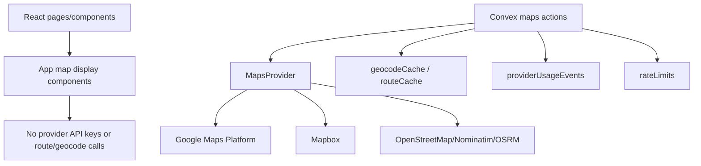

# Maps Module

## Scope

M7 implements the maps module behind `MapsProvider`. Application pages must not import Google Maps, Mapbox, OpenStreetMap, OSRM, Nominatim, or provider SDK APIs directly.

## Architecture

## Provider Rules

- Google Maps is the primary provider by default.
- Mapbox and OpenStreetMap are fallback-compatible providers.
- Google and Mapbox server calls require `SAKNAHA_MAPS_PAID_CALLS_ENABLED=true`; otherwise the server falls back to an available non-paid provider.
- Switching providers uses `SAKNAHA_MAPS_PROVIDER` and does not require page changes.
- Provider API keys stay server-side in Convex environment variables whenever possible.
- Every provider returns the same normalized models for geocoding, reverse geocoding, autocomplete, nearby search, routes, travel time, and marker clustering.

## Server Actions

- `maps.geocode`
- `maps.reverseGeocode`
- `maps.calculateRoute`
- `maps.calculateTravelTime`

Geocoding and reverse geocoding cache successful first results in `geocodeCache`. Route and travel-time calls cache successful route summaries in `routeCache`.

## Fallback

The configured provider is tried first. Configured fallbacks are tried next. If all routing providers fail, the route operation returns a straight-line estimated fallback so the UI can degrade gracefully without crashing.

## Health And Circuit Breaker

Each provider request records lightweight health in `mapProviderHealth`:

- provider,
- operation,
- response time,
- quota status when available,
- failure count,
- circuit-open cooldown.

Retryable failures include timeouts/network failures, HTTP 429, and HTTP 5xx responses. Once a provider reaches the configured failure threshold, the circuit opens for the configured cooldown period and maps actions automatically skip to the next configured provider. Provider selection remains configuration-driven; application pages do not know or choose the active provider.

## Usage And Rate Limits

Every provider call records a `providerUsageEvents` row with capability `maps`. Convex also enforces a provider-level per-minute rate limit through `rateLimits` before making provider calls.

## Environment Variables

- `SAKNAHA_MAPS_PROVIDER`: `google`, `mapbox`, `openstreetmap`, or `disabled`.
- `SAKNAHA_MAPS_PAID_CALLS_ENABLED`: kill switch for paid calls.
- `SAKNAHA_MAPS_CACHE_TTL_SECONDS`: cache TTL.
- `SAKNAHA_MAPS_QUOTA_PER_MINUTE`: per-provider rate-limit budget.
- `SAKNAHA_MAPS_CIRCUIT_BREAKER_FAILURE_THRESHOLD`: failures before circuit opens. Default `3`.
- `SAKNAHA_MAPS_CIRCUIT_BREAKER_COOLDOWN_MS`: circuit cooldown duration. Default 5 minutes.
- `GOOGLE_MAPS_API_KEY`: Google Maps Platform server key.
- `MAPBOX_ACCESS_TOKEN`: Mapbox server token.
- `OPENSTREETMAP_USER_AGENT`: User agent for OpenStreetMap/Nominatim-compatible requests.

## Contract Tests

`@saknaha/providers` includes a shared maps provider contract test. The same test expectations run against Google, Mapbox, and OpenStreetMap adapters to verify normalized output compatibility.
