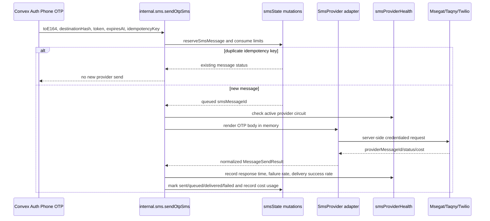

# SMS and OTP Messaging

M8 introduced the production SMS foundation for Saknaha. M9 hardens SMS with an emergency kill switch, IP-aware rate limiting hooks, provider health monitoring, and circuit-breaker failover. Application code must never call SMS vendors directly. All SMS delivery goes through the shared `SmsProvider` contract and the internal Convex SMS action.

## Architecture

## Provider Contract

Supported adapters:

- `msegat`: primary provider.
- `taqny`: interchangeable adapter.
- `twilio`: interchangeable adapter.

Every adapter implements `SmsProvider.sendSms()` and returns the same normalized fields: delivery status, provider message ID, estimated cost, and currency. Provider-specific payloads, status names, credentials, and endpoints stay inside the adapter.

Provider order is configuration-driven. The selected provider is attempted first, then configured fallback providers are attempted when the active provider has an open circuit or temporary failures exhaust retry attempts.

## Emergency Kill Switch

`SAKNAHA_SMS_EMERGENCY_DISABLED=true` disables SMS immediately even when `SAKNAHA_SMS_ENABLED=true`. This is the global rollback switch for provider incidents, abuse spikes, cost anomalies, or suspected credential exposure.

## Idempotency

Phone OTP delivery creates an idempotency key from the OTP channel, destination hash, token hash, and expiry time. `smsMessages.by_idempotency_key` prevents duplicate sends for the same OTP request. Duplicate requests return the existing delivery status and do not consume another SMS rate-limit window.

## Delivery Status

`smsMessages.status` tracks:

- `queued`
- `sent`
- `delivered`
- `failed`
- `expired`

Provider message IDs are stored in `smsMessages.providerMessageId` for reconciliation. OTP codes and rendered SMS bodies are not stored.

## Retry Policy

Temporary provider failures are retried with bounded exponential backoff. Temporary failures include request timeouts, HTTP 429, HTTP 5xx, and similar retryable provider states. Permanent failures such as malformed requests are marked failed immediately and are not retried.

Retry state is stored in:

- `attemptCount`
- `nextAttemptAt`
- `lastError`

`lastError` is sanitized and must not include OTP codes, phone numbers, message bodies, credentials, or sensitive provider payloads.

## Rate Limits

SMS sends are limited by:

- global hourly limit,
- global daily limit,
- per-phone hourly limit,
- per-phone daily limit,
- per-IP hourly limit when a hashed IP is supplied,
- per-IP daily limit when a hashed IP is supplied,
- repeated destination use across multiple known user accounts.

These counters use the existing `rateLimits` table. Phone numbers and IP addresses are represented by hashes only.

Convex Auth's direct phone verification hook does not currently expose a trustworthy raw request IP to the provider callback. Do not attempt to work around this by accepting client-supplied IP addresses or browser-provided IP metadata. Per-IP rate limiting becomes fully effective only when Saknaha is deployed behind an edge proxy or BFF that computes and forwards a trusted `ipHash`.

Until a trusted `ipHash` is available, phone OTP abuse protection relies on per-user limits when a user is known, per-phone/destination-hash limits, idempotency keys, repeated-destination abuse detection, OTP expiry, and provider health controls.

Repeated destination detection blocks cases where multiple known user accounts request OTP SMS to the same destination hash within the configured window. Anonymous pre-auth requests are covered by destination-hash and IP-hash limits.

## Provider Health And Failover

`smsProviderHealth` records:

- provider,
- operation,
- response time,
- failure rate,
- delivery success rate,
- sample counts,
- circuit open timestamp.

When retryable failures push the failure rate above `SAKNAHA_SMS_FAILURE_RATE_DISABLE_THRESHOLD` after the minimum sample size, the provider circuit opens for `SAKNAHA_SMS_CIRCUIT_BREAKER_COOLDOWN_MS`. During that cooldown, delivery automatically skips the unhealthy provider and tries the next configured fallback provider.

The current delivery success rate treats `queued`, `sent`, and `delivered` as provider-accepted success. Later provider webhook reconciliation can refine this to final handset delivery.

## Cost Tracking

Every completed SMS provider attempt records a `providerUsageEvents` row with:

- `capability: "sms"`,
- `operation: "otp_send"`,
- provider,
- status,
- unit count,
- estimated cost and currency.

Provider-returned cost is preferred. When the provider does not return cost, Saknaha records the configured per-message estimate for that provider. These events feed the future admin cost dashboard.

## Security Decisions

- OTP generation remains server-side through Convex Auth.
- OTP codes are passed to the SMS action only long enough to render the provider request in memory.
- Plaintext OTPs, provider credentials, provider auth tokens, and sensitive SMS payloads are never stored.
- SMS provider credentials are read only from server environment variables.
- Application pages and UI components must use AuthService and must never import provider adapters.

## Environment Variables

Core:

- `AUTH_PHONE_OTP_ENABLED`: enables phone OTP when set to `true`.
- `SAKNAHA_SMS_ENABLED`: enables SMS delivery when set to `true`.
- `SAKNAHA_SMS_EMERGENCY_DISABLED`: immediately disables SMS when set to `true`.
- `SAKNAHA_SMS_PROVIDER`: `msegat`, `taqny`, `twilio`, or `disabled`. Default selected provider is `msegat`, but delivery remains disabled unless `SAKNAHA_SMS_ENABLED=true`.
- `SAKNAHA_SMS_FALLBACK_PROVIDERS`: comma-separated fallback order. Default `taqny,twilio`.
- `SAKNAHA_SMS_RETRY_COUNT`: default `3`.
- `SAKNAHA_SMS_OTP_TTL_SECONDS`: default `600`.
- `SAKNAHA_SMS_HOURLY_LIMIT`: default `100`.
- `SAKNAHA_SMS_DAILY_LIMIT`: default `500`.
- `SAKNAHA_SMS_PER_USER_HOURLY_LIMIT`: default `5`.
- `SAKNAHA_SMS_PER_USER_DAILY_LIMIT`: default `20`.
- `SAKNAHA_SMS_PER_IP_HOURLY_LIMIT`: default `20`.
- `SAKNAHA_SMS_PER_IP_DAILY_LIMIT`: default `100`.
- `SAKNAHA_SMS_DESTINATION_ACCOUNT_HOURLY_LIMIT`: default `3`.
- `SAKNAHA_SMS_RETRY_BASE_DELAY_MS`: default `500`.
- `SAKNAHA_SMS_RETRY_MAX_DELAY_MS`: default `30000`.
- `SAKNAHA_SMS_FAILURE_RATE_DISABLE_THRESHOLD`: default `0.5`.
- `SAKNAHA_SMS_HEALTH_MINIMUM_SAMPLE_SIZE`: default `5`.
- `SAKNAHA_SMS_HEALTH_WINDOW_SIZE`: default `50`.
- `SAKNAHA_SMS_CIRCUIT_BREAKER_COOLDOWN_MS`: default `300000`.
- `SAKNAHA_SMS_MSEGAT_ESTIMATED_COST`: default `0.03`.
- `SAKNAHA_SMS_TAQNY_ESTIMATED_COST`: default `0.03`.
- `SAKNAHA_SMS_TWILIO_ESTIMATED_COST`: default `0.04`.
- `SAKNAHA_SMS_COST_CURRENCY`: default `SAR`.
- `SAKNAHA_SMS_OTP_TEMPLATE`: optional server-side OTP template. Must include `{{code}}`.

Msegat:

- `MSEGAT_USERNAME`
- `MSEGAT_API_KEY`
- `MSEGAT_SENDER`
- `MSEGAT_ENDPOINT` optional

Taqny:

- `TAQNY_BEARER_TOKEN`
- `TAQNY_SENDER`
- `TAQNY_ENDPOINT` optional

Twilio:

- `TWILIO_ACCOUNT_SID`
- `TWILIO_AUTH_TOKEN`
- `TWILIO_FROM`
- `TWILIO_ENDPOINT` optional

## Rollback

Disable SMS delivery by setting `SAKNAHA_SMS_ENABLED=false` or `SAKNAHA_SMS_PROVIDER=disabled`. Phone OTP remains feature-flagged and can also be disabled with `AUTH_PHONE_OTP_ENABLED=false`.
